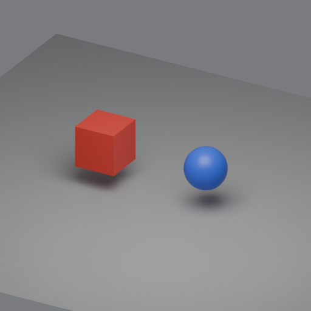

# Disposable connector evidence — 2026-10-05

Actual execution on the verified Apple M5 Ultra / Mac17,15 / 256 GB / 80 GPU. Qwen3.8-27B BF16 revision `6f265714824f3c38d4452baa1628aef3d9b9aae9` used existing MLX-VLM 0.7.4, Python 3.12.13, one resident model and serial requests. **Game generation remains held.**

| Stage | Result | Actual evidence / remaining prerequisite |
| --- | --- | --- |
| Qwen tool call → workspace edit → shell/test | PASS | `qwen3_coder` returned real `write_file` and `run_test` calls; exact hash/path checked; zsh 5.9 / Python 3.12.13 immutable checker passed four numeric inputs |
| Broken fixture and path boundary | PASS | Original incorrect function exited 1; attempted `../outside.py` write rejected |
| Qwen-authored Blender mesh/material scene | PASS | Blender **5.2.0 LTS**, headless CLI, original three meshes / three materials; saved `.blend`, exported FBX and GLB, rendered 512×512 via Cycles CPU / 8 samples / 8 threads; normal exit |
| Blender MCP | NOT RUN | No installed addon/server found on M5; owner must approve/select and install a compatible scoped adapter before MCP qualification |
| Unity asset import / C# compile / pipeline render | NOT RUN | No Unity editor/Hub or license directory found; owner selects/installs a release, activates the appropriate license, and authorizes a rerun with the selected render pipeline |
| Qwen recognition of actual Blender frame | PASS | Fresh image-only request identified a **red cube on the left** and **blue sphere on the right**; independent color masks confirmed left/right centroids |
| Qwen recognition of a Unity frame | NOT RUN | Unity supplied no rendered frame; Blender recognition does not qualify the Unity pipeline |

[Receipt](receipt.json) records settings, all five request usages, parsed tool names, hashes, stage results and the one setup recovery. [Postflight](postflight.json) verifies one healthy idle model, zero renderer processes and only the resident model's remaining GPU holder. Available memory was 190.477 GiB with zero positive swap growth at that snapshot. No sustained throughput, frame-rate, gameplay, rigging or animation claim follows from this small fixture.

The first scene submission was rejected before Blender launch because the diagnostic allowlist omitted normal smoothing and named shader-node removal. The execution lead corrected those permissions and reconciled the unexecuted submission. **Qwen's scene code was not edited by the cloud.** There was one Blender launch, no crash/relaunch, no installation and no existing-game or Screen Sharing/security change.

## Sources and reproducibility

- [asset_scene.py](asset_scene.py): unchanged original local Qwen geometry, materials, camera and lighting.
- [diagnostic.py](diagnostic.py): original local Qwen fixture repair.
- [scene.glb](scene.glb): actual 27,704-byte exported GLB, three meshes and three named materials, no textures or external assets.
- [reproduce_blender.py](reproduce_blender.py): cloud-authored setup wrapper to recreate editable `.blend`, FBX, GLB and render using the existing Blender app, only on an authorized compute host under shared admission.
- [connector harness](../../tools/connector_smoke.py): cloud setup work, excluded from gameplay coding attribution. Its diagnostic AST/allowlist is not an OS security sandbox or a qualified production agent harness.

MIT covers this original diagnostic material; Blender, MLX and the Qwen artifact retain their separate software/model licenses. No asset pack, Tripo, Meshy, third-party art, cloud image generation or game content is included.

Blender inserted a private filesystem path into PNG text metadata and FBX metadata. Public PNG text metadata was removed **without changing the compressed pixel stream**; the receipt gives original model-input and published-image hashes plus the unchanged IDAT hash. Raw `.blend`/FBX containers are omitted; their actual save/export hashes are retained and editable outputs can be recreated from the complete source. Private model reasoning, access tokens, operational paths and runtime logs are excluded.
