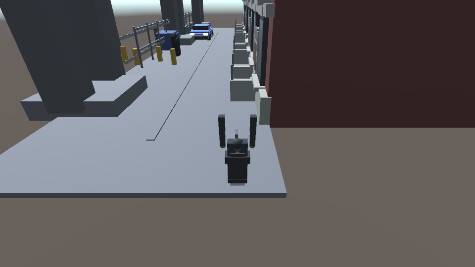

# Continuous queue qualification

**Latest check, 13:22:46 UTC:** the sole owner remains running in its next local vehicle repair round. Candidate `32bd860` compiled and executed, but its [34-second native replay](vehicle-first-attempt/scoped-gate.json) failed because the car moved only **0.372 m**. The [independent trace summary](vehicle-first-attempt/trace-summary.json) confirms E exit before reset (18/18 grounded foot samples), then shows that R incremented Restarts while the player stayed near `(1.748, 0.135, 7.767)` instead of returning to spawn. Neither vehicle collision nor reset is accepted. The controller automatically continued repairing; last playable milestone remains `af675bf`. These failures and precise observations were supplied to local Qwen without cloud gameplay edits or gate changes.

**Verified 13:14 UTC:** the sole owner automatically advanced into **vehicle collision/reset** after a limited world-collision PASS at **13:12:28 UTC**. Local gameplay source is `54580a0eb03160d4d68a2cf576351c83f65c2756`; milestone metadata and last playable HEAD are `af675bfeb164a1dfd6947f9690f61006eca04325`, confirmed published. The connected mission is next. Prior run record hashes are unchanged. One model request is active with none waiting. See the [safe live snapshot](live-snapshot.json).

The [new physical gate and walking regression](collision-candidate/scoped-gate.json) pass: **23 colliders**, **zero forward stop displacement**, approximately **0.00000012 m lateral stop displacement**, stable grounding, and the original **18.979 m walk with 124/124 pavement-covered samples**. The [fresh local critic](collision-candidate/critic.json) gives a scoped PASS with explicit visual caveats. These are physical-control results, not final art or complete collision coverage.

Actual captures: [start](collision-candidate/frame-000.png), [middle](collision-candidate/frame-001.png), [forward stop](collision-candidate/frame-002.png), [lateral stop](collision-candidate/frame-003.png). All four are retained here; the local critic initially saw three. Cloud inspection confirms rough art and poorly readable boundary barriers. Native renderer bounds show cloned boundary fences only **0.0012 m high**, matching their flat-line appearance; the imported basis/scale needs correction during visual integration/polish. This issue is recorded, not silently counted as solved.

The full continuation started **2026-10-05 12:59:59 UTC** from preserved baseline `754dd5956cb5a24c18507aef638c29c4781baa53`. Controller infrastructure is `252f198`; **49 CPU tests pass on both machines**. The original overall ceiling remains **21:37:50 UTC**. One continuous game owner and a separate lightweight checkpoint publisher are active.

The first low-effort local coding round read relevant source but exhausted its 8,192-token output ceiling without a parsed edit. No partial output was applied. The queue then exercised the unchanged baseline with its new external collision probe, yielding an actual, expected red result. Cloud management subsequently narrowed the next local job to a compact collision module and its installation; it did not author game code or relax any gate.

The [native red receipt](baseline-collision-red.json) records a successful native build and 26.015 seconds of actual execution, four rendered captures and 219 trace samples. Collision acceptance correctly failed: only two colliders existed, the player continued moving **3.916 m forward** and **3.664 m sideways** in late held-input windows, and left the bounded paved surface. This qualifies compilation/execution of the added observation harness and detection of this known defect. It is not a collision, vehicle-reset or mission PASS.

The accepted walking and entry/driving/exit evidence remains [separate and preserved](../subfeatures-2026-10-05/README.md). The queue saved real gameplay changes, passed its narrow native gate and regression, received fresh scoped criticism and advanced without stopping. Vehicle reset, mission, combat, audio and ten-minute final quality remain future milestones. See [queue behavior and limitations](../../docs/CONTINUOUS-QUEUE.md).
