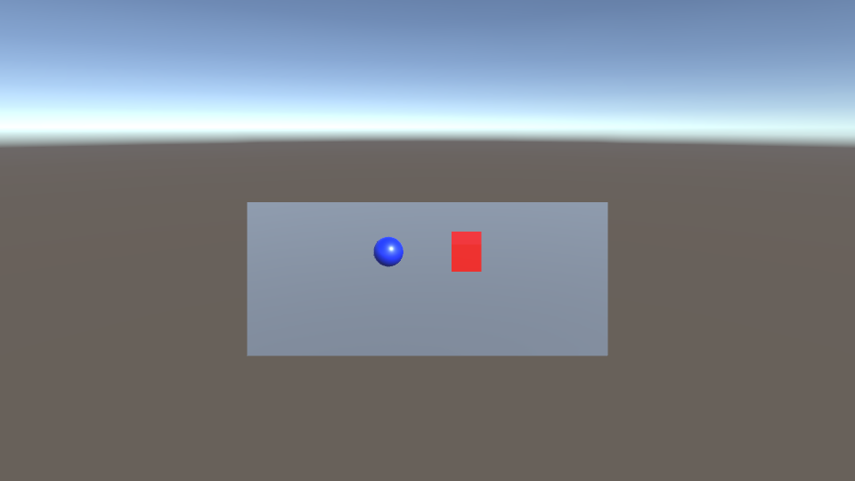

# Controller qualification — 2026-10-05

These are disposable controller fixtures, not Chicago gameplay or art-quality results.

- Thirteen CPU state/edit/evidence/recovery tests pass, including interrupted-edit preservation and restoration of only the owned game directory after repeated failure.
- Actual macOS sandbox probe allowed an owned write and denied protected reads/writes.
- Native Unity 6000.6.4f1 compiled the original prior Qwen Blender fixture and built an ARM64 macOS app. The Metal player ran for 16.017 seconds, recorded 140 samples and four actual frames, and observed 16.094 m displacement from replayed application input.
- The same app with its movement deliberately disabled exited normally but was rejected: 0 m movement and unchanged captures. A clean exit does not count as a pass. See [exact native receipt](native-green-red.json).
- The updated scoped Blender export passed. Editable Blender sources remain outside Unity Assets; the FBX is imported once.
- A fresh Flash-Next session saw an actual stationary frame plus trusted input/movement observations. It identified the blue sphere and red cube, returned FIX, and explained the missing movement. It also read and changed a scoped note using its exact full-file hash. No builder history was supplied. See [sanitized model receipt](model-tools-critic.json).

Qualification exposed and corrected scoped preference/cache writes, Darwin IPC paths, excessively long compiler socket paths, redundant Blender auto-import and macOS app-bundle discovery reads. Earlier failed attempts remain private for diagnosis; no failure was relabeled as a passing playthrough. The model guard cleanly stopped one handoff that exceeded engine ownership/capacity, then was explicitly restored after fixing the cause. A native startup crash was diagnosed before relaunch. The final native and model/tool qualifications completed with the separate existing Blender preserved and no positive swap growth reported.

Camera frames and transform traces do not establish HUD, audio, collision completeness, sustained 60fps or a finished game. See the [runbook](../../docs/CONTROLLER-RUNBOOK.md) for limits and recovery commands.

The first full-game planner session paused before writing game code because the installed generic XML output parser omitted tool schemas and returned nested arrays as strings. A CPU fixture against the installed parser reproduced the boundary behavior. The controller now validates and restores only schema-declared JSON types while preserving source strings exactly; a thirteenth regression test covers it. No private planner history was read for this diagnosis. The paused session is retained and the controller resumes with a fresh planner context.

A subsequent fresh planner request exhausted the original 8,192-token output cap without submitting a complete plan. No partial call executed. The planner now requests five concise tasks and omits builder-only API detail; explicit per-request output is bounded at 16,384 tokens within the unchanged 65,536 working context and resource guards. Installed oMLX source confirms the explicit request limit takes precedence over its 8,192 default. This is a controller budget correction, not a model benchmark or quality result.
