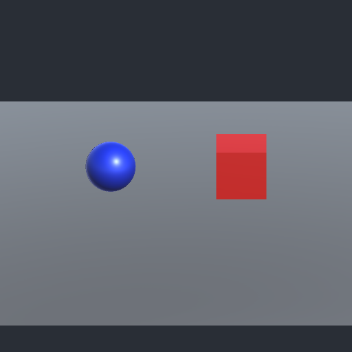

# Post-reboot Unity and Qwen qualification

Verified October 4, 2026, America/New_York (receipts use UTC on October 5). **Original Blender asset → Unity import/C# compile → Metal render → fresh local Qwen vision: PASS. Game generation remains held.**

| Check | Actual result |
| --- | --- |
| Machine | Apple M5 Ultra, Mac17,15, 256 GB, 80 GPU cores; existing verified SSH identity reconnected after its address changed |
| Unity Hub | 3.22.2 installed and running; an active local editor license verified |
| Editor | **6000.6.4f1 ARM64**, installed by the owner; structural verification and real execution pass. This differs from the earlier proposed 6000.3.25f1 LTS package |
| Official Unity CLI | **1.0.0-beta.12** responds; license, disk-space and network preflight pass. The editor executable also works directly for batch automation |
| Blender | **5.2.0 LTS** responds and exports the unchanged local-Qwen scene successfully |
| Import and C# | PASS, native FBX importer, three named mesh objects, three materials, 587 imported vertices, normal exit |
| Render | PASS, actual Metal device, 512×512 PNG, normal exit; three imported meshes/materials retained |
| Local Qwen vision | PASS, fresh image-only context correctly identified the blue sphere on the left and red cube on the right; independent pixel masks corroborated both positions |
| Qwen restoration | Existing pinned BF16 model/runtime restored after a clean reboot stop; one `READY` warm-up and one image request, then healthy idle |
| Runtime files | All 23 files present with expected sizes; available small-file SHA-256 values match; headers still contain 1,184 BF16 tensors. Full weight SHA-256 checks were completed earlier and were not repeated |
| Runtime versions | Python 3.12.13; MLX/MLX-Metal 0.32.3; MLX-VLM 0.7.4; MLX-LM 0.31.3; Transformers 5.17.0 |
| Codex | Installed and running within the `com.openai.codex` application bundle, version 26.930.51102. Existing SSH control works; no second game-development owner was started |
| Basic tools | Git 2.54.0 (Apple Git-157), Python and selected Xcode command-line tools respond |
| Final resources | About 178.9 GiB available, zero swap used/growth, no remaining Unity editor process; the owner's separate Blender instance remains open |

[Execution receipt](receipt.json), [vision evidence](vision-evidence.json), and [final health](postflight.json) are actual M5 results. [UnityFixture.cs](UnityFixture.cs) and the [bounded driver](../../tools/unity_smoke.py) are cloud-authored connector setup, excluded from local game-code authorship. Geometry/material source remains the unchanged [prior local-Qwen scene](../connector-2026-10-05/asset_scene.py), SHA-256 `db4bb2305f5643f1fcaafa18fa22d04be1931d686b0b6ca75f3ee4e392d3aaa7`.

PNG SHA-256: `45d5d0c0dbb093bec809cd674dad51f3360cded758cb26def6590e5c4610a148`. Its only chunk types are IHDR, IDAT and IEND; no private text metadata is published. The Unity camera/import coordinate frame produces a different left/right composition from the earlier Blender camera. Vision was checked against this actual image, with no expected labels supplied in its prompt.

## Remaining setup distinctions

- **SSH-side CLI account access:** `auth status` reports no active session, while `auth list` finds one stored account without an active selection. CLI diagnostics report Keychain rejecting its credential-store probe. Hub/editor licensing is active and the actual local editor test passes. This is an unresolved remote CLI account-storage issue, not an editor-license failure. No account switch, credential entry, license activation or security change was performed.
- **PATH:** the Unity CLI directory is absent from the tested SSH login shell's PATH. Task commands use its explicit executable location successfully; no reinstall is required for that usage.
- **Editor Pipeline/MCP:** no connected Pipeline-enabled editor was present. The one registered project had URP 17.6.0 in its manifest; that rendering package is distinct from the Editor Pipeline automation package. Its project content was not changed. This check qualifies native editor batch automation, not the separate live Pipeline/MCP commands. Select and qualify those in the eventual game project if needed.
- **Blender MCP:** remains unqualified; the working Blender CLI covers this demonstrated author/export path.
- **Rosetta:** no installation receipt was found. The native ARM64 import/compile/render path nevertheless passed; no Rosetta agreement or installation was performed.
- This fixture proves connectivity, not sustained game-building quality, gameplay acceptance, rigging/animation, frame rate, long-run recovery or a production render-pipeline choice.

## Admission diagnosis and scoped owner authorization

The first attempt stopped before engine launch because the original diagnostic was conservative about an already-open Blender. A subsequent headless import was interrupted when Null-device import workers were overcounted. Seven positive/negative classifier checks qualified the correction: Hub and licensing helpers are not renderers, and only explicitly headless import workers are excluded.

The licensed import/C# stage then passed. Two rendered attempts stopped cleanly when Unity initialized an additional **Metal** import worker alongside its editor and the external Blender. The documented `-refreshImportMode InProcess` option alone did not prevent that hardware worker in this fixture. These were controlled monitor stops, not engine crashes; there was no unattended relaunch loop.

The owner explicitly authorized completing the M5 test with Blender open. The successful run reserved both existing shared capture locks and allowed only the observed shape: **one preserved external Blender, one owned Unity editor, and at most one owned Metal import worker**. Worker identity must match the editor executable and parent PID. Memory/swap and desktop guards remained active. This invocation-scoped exception does not silently alter the shared default or permit unrelated extra renderers. Unity and its worker exited before Qwen restoration/vision.

Runtime restoration is explicit through `--resume-stopped-session`, only from a clean `stopped-by-request` receipt. It reuses the task's existing owned mode-0600 token with symlink/format checks, preserving its virtualenv interpreter and pinned weights. No boot-time automatic restart or game loop was configured. One external Blender is counted under `--allow-one-existing-renderer`; additional renderer activity stops the owned model for capacity coordination.

Private logs, account identifiers, credentials, operational paths, raw reasoning, editable engine caches and FBX metadata are excluded. Reproduce FBX from the original source rather than distributing its private-path metadata.

Official references: [installed editor release](https://unity.com/releases/editor/whats-new/6000.6.4f1), [editor command-line arguments and import modes](https://docs.unity3d.com/6000.6/Documentation/Manual/EditorCommandLineArguments.html). Installed CLI help and actual local execution supplied the version-specific command evidence.
