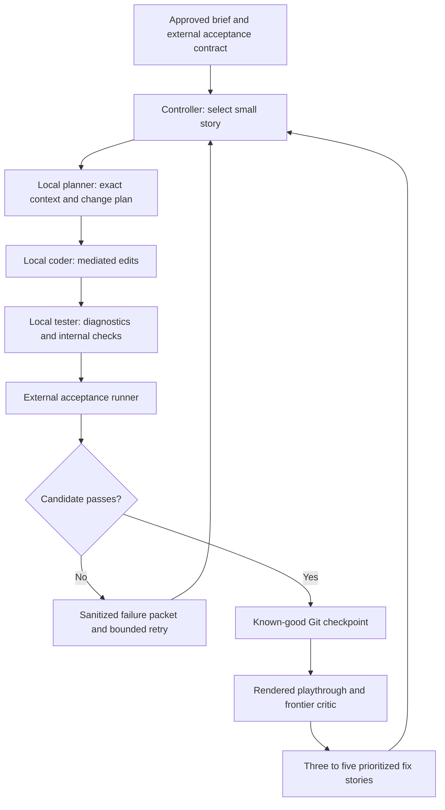

# Architecture

This is a proposed design, not an implemented or qualified system.

## Roles and flow

Use one controller and mostly sequential local-model contexts. Planner, coder, and tester are roles with separate context and permissions; they need not be three simultaneously loaded models. Keep expensive generation and rendering bounded and session-owned.

The cloud critic assesses evidence and proposes fixes. Any cloud-authored gameplay repair is explicitly labeled rescue coding. It does not count as local coding. A tester's self-assessment cannot promote a candidate.

## Exact source context

Every story packet identifies the repository commit, source hashes, allowed edit paths, dependency/API versions, relevant scenes/resources, acceptance requirements, and the last reproducible failure. Retrieve current source through tools. For large files, use exact named ranges and dependency references with hashes, then re-read the surrounding integration points before editing.

Omissions must be visible. A source file is never assumed to be fully available because its name appears in a tree. Do not silently exclude all `scripts/` directories or every large file: that can remove gameplay, integration code, and the verification contract. Oversized files should be split deliberately or retrieved in relevant chunks, rather than rewritten from memory.

Retain concise facts and decisions between iterations. Public progress records summarize outcomes; they do not store private conversations or hidden reasoning.

## Mediated edits

Prefer a qualified tool-calling harness with file reads and targeted edits over parsing and replaying `FILE` markers from model prose. OpenCode is a candidate, subject to qualification of the exact local model and provider. Reliable tool use must be demonstrated after start; it is not guaranteed by the framework name.

The controller must enforce canonical project-relative paths, reject path escapes/symlinks outside the work area, check expected content/hash before changing a file, and verify the resulting diff. Edits apply atomically where possible. All mutation routes—including engine/MCP scripting, arbitrary shell commands, cleanup helpers, and retry/replay helpers—must respect the same boundary.

Keep the external acceptance harness and its configuration outside the coder's writable environment, pinned by hashes and executed by a separate trusted runner. Merely omitting a test file from an edit list is insufficient if another tool can rewrite it. The local tester may create internal diagnostics, but cannot change the external acceptance contract or sign its result.

## Acceptance and visual evidence

Use a layered gate: import/parse → deterministic input/physics checks → full mission state checks → rendered input-driven playthrough → visual/audio/performance review. Headless tests validate logic; they cannot establish camera feel, final appearance, sound balance, or rendered frame rate.

Run checks against the exact candidate commit and build. Preserve structured exit status, diagnostics, measured assertions, harness hash, seed, settings, and evidence IDs. Parse/autoload/resource errors, missing assertions, unknown test operations, timeouts, and missing outputs fail the gate even if a success string appears. A grep, self-score, screenshot alone, or stale recording cannot prove completion.

Validate the harness with intentional broken fixtures: disable movement, break a scene reference, remove vehicle possession, bypass an objective, and force an invalid success sentinel. Each relevant defect must produce a red result. Review these checks separately from gameplay implementation.

Rendered playthroughs must use the real input path and cover launch, foot/vehicle camera transitions, the approved mission, ending, failure/restart, and demanding views. Record frame times and hitches at declared settings. Compare captures at stable camera positions against the approved art targets.

## Critique and checkpoint promotion

Give the frontier critic the approved brief, candidate commit, complete playthrough, representative captures, performance evidence, and known defects. Ask for three to five prioritized, observable fixes with impact and a verification method. Convert each into a small story; do not let criticism expand the approved scope automatically.

Maintain a candidate branch and an immutable known-good checkpoint. Promotion requires the complete protected gate and required presentation review. Store the commit and evidence bundle together. Recovery returns a new session-owned candidate to the known-good state while preserving failed candidates and evidence for diagnosis; it must not reset another collaborator's work.

## Durable state and recovery

Record run/story IDs, role session IDs, input commit/context hashes, proposed edits, tool action IDs, candidate commit, gate result, checkpoint, and intervention count. After a crash or uncertain tool response, reconcile the actual files/process state before retrying. Design repeatable operations to be idempotent where possible.

Session persistence, fork/revert features, or a workflow library do **not** prove exactly-once side effects. Avoid automatic replay of a generation, file mutation, paid request, or engine launch whose outcome is unknown. A stopped controller must not leave a respawner continuing the run.

Watchdogs observe useful progress, budgets, memory/disk pressure, resource ownership, and output freshness—not only process liveness. Set explicit timeouts and retry caps. Pause on repeated failures, invalid evidence, exhausted budget, unavailable desktop/renderer, or conflicting ownership. Stop owned driver scripts before stopping their engine. No automatic relaunch after two crashes. Future renderer use must follow the verified host's shared cap, never raise it automatically, and never take over existing benchmark/game jobs.

## Provenance and local coding share

For each accepted story, record model artifact/hash, runtime and quantization, actual context/settings, role, commit/diff, elapsed time, tool actions, tests, and author class: local, cloud rescue, human, or mixed. Record generated assets and paid-service contributions separately from gameplay coding.

The local coding target is about 90% of actual accepted gameplay work. Before start, choose a primary attribution metric and audit mixed edits; track accepted tasks and code contributions alongside it. Changed-line counts alone can be inflated by rewrites, and tokens/time are not gameplay authorship. Report the observed share and exceptions honestly rather than assigning cloud repairs to the local model.

Only sanitized summaries and redistributable evidence are published. Keep credentials, private transcripts, hidden reasoning, and machine-specific operational paths out of the public ledger.
