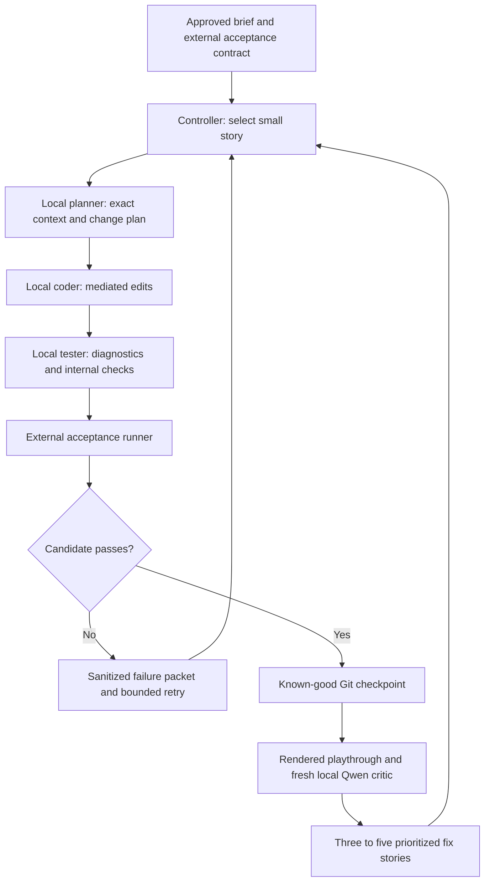

# Architecture

Updated 2026-10-05. The game loop is proposed and held. Model download, settings fixtures and one short warm-up are implemented; see [runtime readiness](RUNTIME-READINESS.md).

## Roles and flow

Use this Codex management thread as the intelligent cloud supervisor, with serial local Qwen planner, coder, tester and fresh visual-critic contexts. It reviews real artifacts, prioritizes gaps and redirects stalled work. A process watchdog supplies liveness/resource alarms. One BF16 model is resident; roles have separate histories and permissions. Keep generation and rendering bounded and task-owned.

Codex supervision can spot-review evidence and escalate genuine blockers. Record those interventions separately from local Qwen's substantive game work. Any separately approved cloud-authored gameplay repair is labeled rescue coding. A tester's self-assessment cannot promote a candidate.

## Exact source context

Every story packet identifies the repository commit, source hashes, allowed edit paths, dependency/API versions, relevant scenes/resources, acceptance requirements, and the last reproducible failure. Retrieve current source through tools. For large files, use exact named ranges and dependency references with hashes, then re-read the surrounding integration points before editing.

Omissions must be visible. A source file is never assumed to be fully available because its name appears in a tree. Do not silently exclude all `scripts/` directories or every large file: that can remove gameplay, integration code, and the verification contract. Oversized files should be split deliberately or retrieved in relevant chunks, rather than rewritten from memory.

Retain concise facts and decisions between iterations. Public progress records summarize outcomes; they do not store private conversations or hidden reasoning.

## Mediated edits

Prefer a qualified tool-calling harness with file reads and targeted edits over parsing and replaying `FILE` markers from model prose. OpenCode is a candidate, subject to qualification of the exact local model and provider. Reliable tool use must be demonstrated after start; it is not guaranteed by the framework name.

The controller must enforce canonical project-relative paths, reject path escapes/symlinks outside the work area, check expected content/hash before changing a file, and verify the resulting diff. Edits apply atomically where possible. All mutation routes—including engine/MCP scripting, arbitrary shell commands, cleanup helpers, and retry/replay helpers—must respect the same boundary.

Keep the external acceptance harness and its configuration outside the coder's writable environment, pinned by hashes and executed by a separate trusted runner. Merely omitting a test file from an edit list is insufficient if another tool can rewrite it. The local tester may create internal diagnostics, but cannot change the external acceptance contract or sign its result.

## Acceptance and visual evidence

Use a layered Unity gate: import/C# compile → controlled input/physics checks → full mission state checks → rendered input-driven playthrough → visual/audio/performance review. Headless tests validate logic; they cannot establish camera feel, final appearance, sound balance or rendered frame rate. Fixed seeds/ticks do not guarantee deterministic engine physics. Use tolerances, repeated native runs, pinned-runtime scenarios and renderer-specific baselines; qualify the chosen Unity test/capture adapter. GdUnit4/GUT references apply only if a later Godot option is approved.

Run checks against the exact candidate commit and build. Preserve structured exit status, diagnostics, measured assertions, harness hash, seed, settings, and evidence IDs. Parse/autoload/resource errors, missing assertions, unknown test operations, timeouts, and missing outputs fail the gate even if a success string appears. A grep, self-score, screenshot alone, or stale recording cannot prove completion.

Validate the harness with intentional broken fixtures: disable movement, break a scene reference, remove vehicle possession, bypass an objective, and force an invalid success sentinel. Each relevant defect must produce a red result. Review these checks separately from gameplay implementation.

Rendered playthroughs must use the real input path and cover launch, foot/vehicle camera transitions, the approved mission, ending, failure/restart, and demanding views. Record frame times and hitches at declared settings. Compare captures at stable camera positions against the approved art targets.

## Critique and checkpoint promotion

Give a fresh local Qwen visual critic the approved brief, candidate commit, complete playthrough, immutable representative captures, performance evidence and known defects. It must not inherit the builder's self-assessment. Ask for three to five prioritized, observable fixes with impact and a verification method. Codex management reviews that evidence and progress before redirecting work. Convert fixes into small stories; criticism cannot expand the approved scope automatically.

Maintain a candidate branch and an immutable known-good checkpoint. Promotion requires the complete protected gate and required presentation review. Store the commit and evidence bundle together. Recovery returns a new session-owned candidate to the known-good state while preserving failed candidates and evidence for diagnosis; it must not reset another collaborator's work.

## Durable state and recovery

Record run/story IDs, role session IDs, input commit/context hashes, proposed edits, tool action IDs, candidate commit, gate result, checkpoint, and intervention count. After a crash or uncertain tool response, reconcile the actual files/process state before retrying. Design repeatable operations to be idempotent where possible.

Session persistence, fork/revert features, or a workflow library do **not** prove exactly-once side effects. Avoid automatic replay of a generation, file mutation, paid request, or engine launch whose outcome is unknown. A stopped controller must not leave a respawner continuing the run.

Watchdogs measure progress signals, budgets, memory/disk pressure, resource ownership and output freshness. Codex management supplies judgment about repeated failures, scope and quality. Set explicit deadlines and retry caps. Pause on invalid evidence, exhausted budgets, unavailable desktop/renderer or conflicting ownership. Stop owned drivers before their engine. No automatic relaunch after two engine crashes; the current model supervisor stops on its first new fault. Follow the verified host's shared cap and preserve other benchmark/game jobs. The closed benchmark's historical stop counter remains unchanged and scoped to that campaign.

## Provenance and local coding share

For each accepted story, record model artifact/hash, runtime and quantization, actual context/settings, role, commit/diff, elapsed time, tool actions, tests, and author class: local, cloud rescue, human, or mixed. Record generated assets and paid-service contributions separately from gameplay coding.

The local coding target is about 90% of actual accepted gameplay work. Before start, choose a primary attribution metric and audit mixed edits; track accepted tasks and code contributions alongside it. Changed-line counts alone can be inflated by rewrites, and tokens/time are not gameplay authorship. Report the observed share and exceptions honestly rather than assigning cloud repairs to the local model.

Record imported baseline code separately from new integration work. Existing MIT controller/vehicle/harness source was written upstream; it must not be credited as code authored by local Qwen in this run. Disclose inherited source, local changes, cloud rescue and cloud NPC runtime inference separately in video claims.

Only sanitized summaries and redistributable evidence are published. Keep credentials, private transcripts, hidden reasoning, and machine-specific operational paths out of the public ledger.
