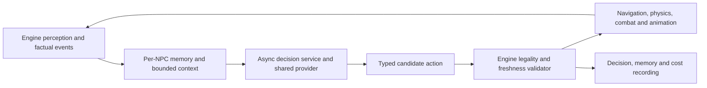

# Persistent model-powered NPCs

Planning only; no provider calls, credentials, runtime integration, or gameplay tests have been made. This is a reusable technology requirement for future gaming showcases, not authorization to implement several games in this repository.

## Two distinct uses of AI

The proposed local Qwen model writes game code during development. NPC runtime brains make decisions inside a running game and may use a remote cheap Chinese/GPT model or Jev. A video must disclose these separately. A locally coded game with cloud-powered NPCs is not an all-local NPC inference demonstration.

Every NPC should have a model-connected high-level decision policy, distinct identity, observations, memories and relationships. Ten NPCs can share one provider/backend and queue: ten characters do not require ten loaded model copies. Separate per-NPC context and storage are essential; sharing infrastructure must not merge their private memories or knowledge.

## Engine authority, model advice

The engine owns fixed-rate locomotion, pathfinding, collision, combat range/cooldowns, animation and mission legality. Models choose high-level intents from actions the engine currently permits: investigate a heard sound, approach a visible actor, ask a question, offer help, flee to a valid exit, resume a route, or wait. The model cannot teleport, write scripts, grant damage through walls, change quest completion, or mutate arbitrary world state.

Use typed action IDs with bounded parameters, known target IDs, and a finite menu. Engine validation covers actor/target existence, perception permission, navigation reachability, range, cooldowns, resources, story constraints and fairness. Schema-valid output can still be a bad or illegal gameplay decision; validate semantics regardless of provider claims.

## Asynchronous cadence and safe results

Issue requests on meaningful events or a bounded decision heartbeat, not every physics frame: new perceptible evidence, a conversation turn, goal completion, blocked route, a relationship-relevant encounter, or pursuit-state change. Stagger NPCs, limit in-flight requests, coalesce superseded observations, and prioritize nearby/relevant actors. Dormant characters retain their identity and state without paying for frame-by-frame queries.

Each request carries NPC/player IDs, request/sequence ID, observation revision, memory version, allowed actions and expiry. Accept a result only if its revision is still applicable and its action remains legal at execution time. Drop late/out-of-order responses. Cancel obsolete work where supported; do not reuse an old attack or conversation choice after the situation changes.

During a request, the engine continues the last valid intent or a deterministic fallback. Timeouts, malformed output, low confidence where supplied, provider failure, and exhausted cost budget lead to a safe fallback such as wait, continue route, or return to a permitted search state. Never block rendering or invent an answer. Record fallback behavior so an outage is not presented as live AI success.

## Identity, factual memory and relationships

Use stable `npc_id`, `player_id` and save/world IDs. Each NPC stores an authored identity/personality, current goals, factual event history, relationship state, and a bounded retrieval index. An event includes ID, time, observer, subject, event type, source/perception provenance and relevant uncertainty. Examples: this player helped me, I saw them steal an object, I heard a crash nearby, or they previously broke a promise.

Only engine-confirmed/permitted events become facts. Store heard claims and uncertain observations as such; do not turn generated dialogue or a guessed motive into a witnessed event. A model cannot manufacture prior meetings, knowledge of an unseen crime, or a relationship change unsupported by an event.

Retrieve a small recent/relevant set plus durable relationship facts. Summaries must retain event IDs, uncertainty and attribution; they compress records rather than create facts. Bound memory tokens and relationship values such as trust/fear/hostility, with game-defined update rules tied to events. If a model proposes an update, validate its evidence and limits before applying it. Prevent duplicate events from changing a relationship twice.

Durable saves include event IDs, relationship values, goals, memory version and summary provenance. Use atomic/versioned saves, stable IDs across reload, and replayable updates. Player-facing reset/delete controls and retention policy should match the approved game design. Fictional records should not collect unnecessary real player identity or secrets.

NPC observations are limited to what that character can see/hear/remember. A monster searching for a player receives permitted last-seen/heard information and uncertainty, not a hidden exact player transform. Nearby NPCs may share information only through explicit game events with provenance. The shared backend does not grant shared omniscience.

## Decisions and dialogue are separate

Jev is a proposed structured-decision candidate, not a free-form dialogue generator. TypeSafe's current model documentation lists `jev-1.13.0`, text input and free output; it does not accept native image/audio/video input. The launch article reports 70–500 ms response times. These are vendor claims, not measured game latency or a final provider selection. [TypeSafe models](https://docs.typesafe.ai/models), [launch article](https://typesafe.ai/blog/introducing-system-one-models-and-jev).

A cheap Chinese or GPT chat model can be a separate dialogue backend, or a decision alternative that returns validated structured actions. Dialogue generation never becomes authoritative game state: it can propose phrasing within known facts, personality and relationship boundaries. Any promised gameplay effect must pass an allowed-action check separately. For short reactive requests, qualify non-thinking/low-effort modes where supported and bound output; do not assume all providers expose identical settings.

Official price snapshot checked 2026-10-03, USD per million tokens:

| Proposed candidate | Input | Output | Scope/source |
| --- | --- | --- | --- |
| Jev `jev-1.13.0` | $0.042 | Free | Structured decisions; [TypeSafe models](https://docs.typesafe.ai/models) |
| Qwen3.7-Flash | $0.028 | $0.110 | Alibaba Global deployment, input ≤32K/request; Singapore prices differ; [official pricing](https://www.alibabacloud.com/help/en/model-studio/model-pricing) |
| GPT-6 Luna | $0.10 | $0.50 | Standard uncached text rates; [official model page](https://developers.openai.com/api/docs/models/gpt-6-luna) |

These are candidates, not selected integrations. Availability, region, exact model ID, structured-output behavior, current terms and actual end-to-end latency must be verified before future use. No paid request has been made.

## Cost and credentials

Put API credentials in a trusted server/service, never in an exported Godot/Unity client, source repository, or recording. The game authenticates to a narrow decision service with per-session/NPC rate limits, short bounded observations, finite action schemas and capped output. The service enforces concurrency, per-minute and session spend caps, request deadlines, caching policy and a circuit breaker. No client-supplied prompt can request arbitrary paid work.

Estimate decision cost as `requests × (input_tokens × input_price + billed_output_tokens × output_price) / 1,000,000`. Include retries, summaries and background NPC activity.

Illustration: ten active NPCs, a ten-minute session, one request per NPC every five seconds on average, 800 billed input tokens and 60 billed output tokens/request where applicable: 1,200 calls, 960,000 input tokens, and 72,000 output tokens. The provider alternatives cost about **$0.04032 Jev**, **$0.03480 Qwen Global**, or **$0.132 GPT-6 Luna** at the listed token rates. They are alternatives, not an additive bundle. These planning assumptions exclude extra dialogue, summaries, retries, hosting, voice, taxes and other charges; they are not measured usage or a budget approval.

Choose the smallest adequate backend through later controlled comparisons of action quality, observed end-to-end latency, stale/invalid decisions, fallback rate, memory fidelity and total cost. A low token price alone does not establish the best game behavior.

## Honest YouTube evidence

Record the actual observable state, permitted action list, request ID, model/provider/version, returned action, confidence if provided, validation outcome, applied/fallback action, measured latency, token usage, estimated/billed cost, and factual memory/relationship changes with event IDs.

An optional debug overlay and replay can show what an NPC observed, remembered and chose. Label live model responses, replayed decisions, deterministic fallback and cloud runtime inference accurately. Do not invent or display hidden model thoughts. A relationship demo should show the first encounter, saved evidence, later recognition after reload, and differing responses from distinct NPCs sharing one backend.

Before implementation, agree on provider access/terms, cost ceiling, action schema, perception rules, memory/save design, replay policy and acceptance tests. Future tests should deliberately inject timeouts, stale results, illegal actions, duplicate events and unsupported memories. None has been performed yet.

A concrete memory test: help NPC A, insult B, let C witness the relevant encounter while D is elsewhere, then save/reload. A/B retain their event-supported relationships; C knows only what it observed; D remains unaware until an actual information-sharing event. Show event IDs and applied memory changes in the recording.

## Additional architecture references only

Start with a small SQLite factual event journal and bounded per-NPC retrieval rather than adopting a large memory stack. Research references include [Generative Agents](https://github.com/joonspk-research/generative_agents) (Apache-2.0 code, old research implementation; bundled-art rights need review), [AI Town](https://github.com/a16z-infra/ai-town) (MIT code, separate art licenses, browser/Convex/Pixi architecture), and [Mem0](https://github.com/mem0ai/mem0) (Apache-2.0 memory plumbing; does not enforce witnessed-event truth). Native local-runtime candidates include [LLMUnity](https://github.com/undreamai/LLMUnity) (Apache-2.0) and [NobodyWho](https://github.com/nobodywho-ooo/nobodywho) (EUPL-1.2; copyleft and model-license review required). None is imported, installed, qualified, or selected here.
